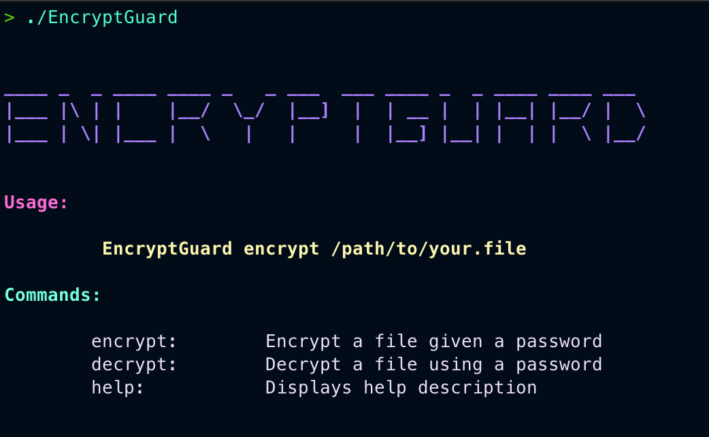

<pre align="center">
____ _  _ ____ ____ _   _ ___  ___ ____ _  _ ____ ____ ___  
|___ |\ | |    |__/  \_/  |__]  |  | __ |  | |__| |__/ |  \ 
|___ | \| |___ |  \   |   |     |  |__] |__| |  | |  \ |__/ 
                                                            
</pre>
<hr>
Encounter a superior layer of security with this file encryption and decryption tool written in go. This utility offers advanced protection mechanisms to safeguard your sensitive data with ease and reliability.

## Usage 

<b>Open help menu</b>

```bash
go run . help
EncryptGuard.exe help
```

<b>Encrypt</b>

```bash
go run . encrypt test.jpeg
EncryptGuard.exe encrypt test.jpeg
```

<b>Decrypt</b>

```bash
go run . decrypt test.jpeg
EncryptGuard.exe decrypt test.jpeg
```

<br>
<i><u>NOTE</u>: This tool is support both for Windows and Linux</i>

<br>
